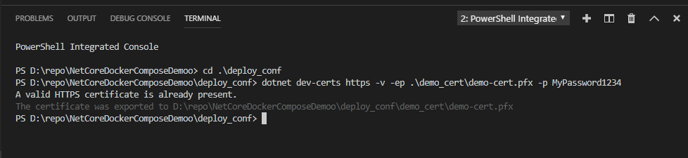

# Deploy using Docker Compose

1. A demo SSL certificate can been gnerated like following:  
   
2. Set Following Environment variables:  

    | Variable Name  | Purpose | default if not set |
    | --- | --- | --- |
    | **DOCKER_REGISTRY** | docker registry name | use local docker images |
    | **FRONTEND_VER** | front end docker image tag | _latest_ if not set |
    | **BACKEND_VER** | backend end docker image tag | _latest_ if not set |
    | **SSL_PASS** | ssl certificate password | will be empty |
    | **HTTP_PORT** | http serving port | _80_ |
    | **HTTPS_PORT** | https serving port | _443_ |

3. Start up using docker-compose:

   ```bash
   docker-compose -p demo_deploy up -d
   ```

4. Stop using docker-compose:

    ```bash
    docker-compose -p demo_deoploy stop
    ```
